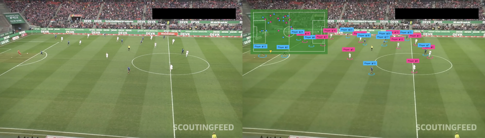
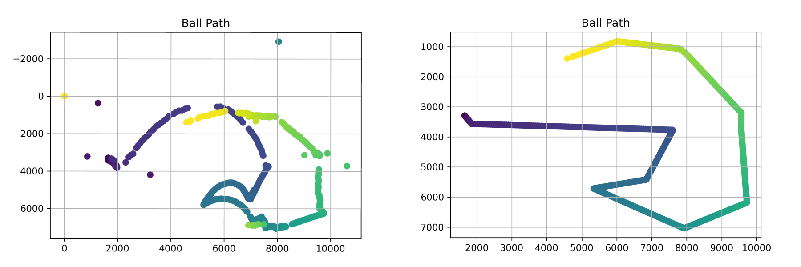
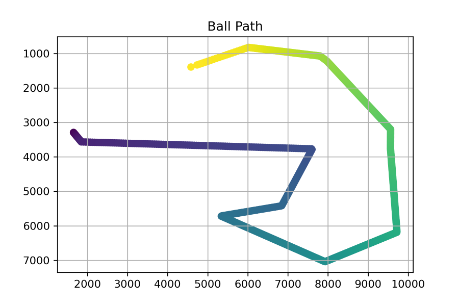
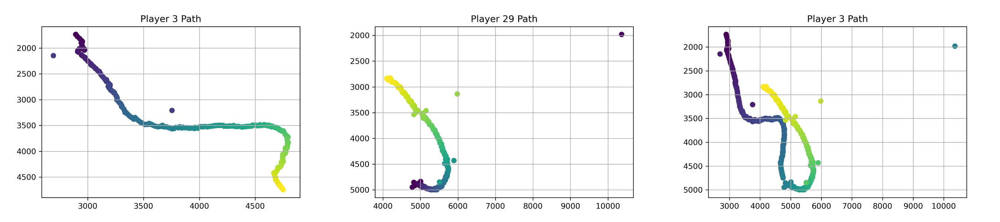
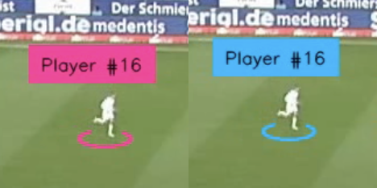

# Football Tracking Data Generation
Convert football match footage into proffesional level player & ball tracking data utilizing [Roboflow's](https://roboflow.com/) machine learning and computer vision libraries. The goal of this project is to enable clubs at any level to turn their match footage into match tracking data and match event data, which they can use to step their match analysis to the next level!


### Table of Contents
<!--TOC-->
- [Football Tracking Data Generation](fFootball-tracking-data-generation)
  - [Getting Started](#getting-started)
  - [Match Footage to Tracking Data Pipeline](#match-footage-to-tracking-data-Pipeline)
    - Training a Player Detection Model
    - Tracking Match Footage
    - Cleaning Tracking Data
    - Generating Tracking Clips
  - [Resources](#resources)
  - [Licenses](#license)

## Getting Started
1. Clone the repository

    ```shell
    git clone https://github.com/JohnComonitski/FootballTrackingDataGeneration.git
    ```

2. Move to the project directory

    ```shell
    cd FootballTrackingDataGeneration
    ```

3. Create and activate a Python
    [virtual environment](https://docs.python.org/3/library/venv.html#creating-virtual-environments).
    On GNU/Linux systems this is as easy as:

    ```shell
    python3 -m venv .venv
    . .venv/bin/activate
    # Work inside the environment.
    ```
  > [!NOTE]
  > This project was built with Python 3.11


4. Install the Python dependencies
    ```shell
    pip install -r requirements.txt
    ```
  > [!NOTE]
  > **_requirements.txt_** includes commented out packages which utilize your GPU. If your machine has a GPU, I recommend you uncomment out those packages.

5. Get a Roboflow API Key
   
    Create an account with [Roboflow](https://roboflow.com/) and get an API key.

6. Create env/keys.env

    ```shell
    touch env/keys.env
    ```

7. Add your API Key to env/keys.env

    ```
    ROBOFLOW_API=XXXXXXXXXXXXXXX
    ```

## Match Footage to Tracking Data Pipeline



Taking raw match footage and generating proffesional level player tracking data follows a 4 step process:
1. Train a Player Detection Model
2. Track Your Match Footage
3. Clean Your Tracking Data
4. Generate a Tracking Data Clip

### Step 1: Training a Player Detection Model
The creation & training of a player detection model is performed by [train/train.ipynb](./train/train.ipynb). 

If you work through this notebook, you will have a player detection model capable of detecting players, balls and referees. Models will be saved to the [model/](./model) directory as a `.pt` file. Once your model is trained, you are ready to start tracking match footage!

**Tips!**
- Training can take quite a long time, depending on the resources available to your machine.
- If you are using a machine without a GPU, you may find faster training results using Google Collab and their (relatively) afforable GPU pricing.

### Step 2: Tracking Match Footage
Tracking match footage is performed by [track/track.ipynb](./track/track.ipynb).

**How to Track Match Footage**
1. Copy the clip you would like to track to the [track/footage/](./track/footage) directory.
2. Open [track/track.ipynb](./track/track.ipynb) and update your configuration variables if need be.
- If you want a tracking video output, set `generate_video` to `1` in the Configurations section:
    ```python
    GENERATE_VIDEO = 1
    ```
> [!Warning] 
> The output at this stage will likely be rough and choppy tracking footage with many miss detections. I do not recommend you turn this on at this stage, as it will slow down tracking. This is best used as a reference to make sure your tracking is on the right track and not your final output.
- If you want teams tracked, set `track_teams` to `1` in the Configurations section:
    ```python
    TRACK_TEAMS = 1
    ```

3. In the **_Getting Your Model_** section, either import models from Roboflow or point your notebook to your trained models.
    ```python
    PLAYER_MODEL_FILE_NAME = 'model.pt'
    PLAYER_MODEL_PATH = "./../models/" + PLAYER_MODEL_FILE_NAME
    PLAYER_DETECTION_MODEL = YOLO(PLAYER_MODEL_PATH)
    ```
    ```python
    FIELD_MODEL_FILE_NAME = 'best.pt'
    FIELD_MODEL_PATH = "./../models/" + FIELD_MODEL_FILE_NAME
    FIELD_DETECTION_MODEL = YOLO(FIELD_MODEL_PATH)
    ```

4. Update the `VIDEO_FILE` and `SOURCE_VIDEO_PATH` variables to point to your footage.
    ```python
    VIDEO_FILE = "2e57b9_0.mp4"
    SOURCE_VIDEO_PATH = './footage/' + VIDEO_FILE
    ```

5. Run the notebook to track your footage.
> [!Note] 
> Once complete, results will be saved to [track/output/](./track/output) directory.

### Step 3: Cleaning Tracking Data
Tracking results can be found in the [track/output/](./track/output) directory as a CSV. Often the initial tracking results are imperfect and requires clean up. Tracking data can be cleaned using the [Tracking Data Clean Up Notebook](./data_cleanup/cleanup.ipynb) notebook. This notebook imports the Match library, which includes a series of tools to evaluate & clean tracking results.

**How to Clean Tracking Data**
1. Open the [Tracking Data Clean Up Notebook](./data_cleanup/cleanup.ipynb)
2. Add the name of the file you wish to clean to the notebook in the **_Tracking Data Import_** section.
    ```python
    PATH = "./../track/output/"
    FILE_NAME = ""
    ```
3. Go to the **_Data Cleaning_** section. This is where you can work with the **_match_** object to clean your tracking data.
4. Once cleaning is complete, your results will be exported to the [data_cleanup/output/](./data_cleanup/output) directory.

**Cleaning Ball Pathing:**

The ball path is probably the most difficult object to track. Calling `match.ball` will give you the **_Ball_** object, which has a method called `clean_path()`, which will review the ball's path and remove outlier detections, fill in the gaps for missing detections, and flatten arcs in the ball's 2D path. 

```python
ball = match.ball
ball.clean_path()
```


**Visualize an Object's Path:**

If you want to visualize your data cleaning, the **_Ball_** object and the **_Player_** object can both call `plot()` and this will plot their path.

```python
ball = match.ball
ball.plot()
```


**Get a Player Object**

Players are represented as a **_Player_** object. These players and their tracking data can be programmatically edited by first getting their respective **_Player_** object by passing their player ID to `match.player()`.
```python
player = match.player(1)
```

**Remove Players**

If an object has been missdetected as a **_Player_** object, `match.remove_player()` can be called to remove them from your tracking data.
```python
player = match.player(32)
match.remove_player(player)
```

**Combine Players**

It is possible that a player could be tracked, lost, and then reemerge as a new play. In these cases, you may want to merge these players to combine their tracking data using `match.merge_players()`.
```python
player_1 = match.player(13)
player_2 = match.player(39)
match.merge_players(player_1, player_2)
```


**Change a Player's Team**

If a player has been assigned to the wrong team, that **_Player_** object can call `change_team()` to reassign their team (`0` is home and `1` is away).
```python
player = match.player(16)
player.change_team(1)
```


**Rename a Player**

If you want a player to have a different name other than their ID, you can rename them using `change_name()`
```python
player = match.player(16)
player.change_name("Harry Kane")
```

### Step 4: Generating Tracking Clips

Whether you have raw tracking data or you just finished cleaning your tracking data, you can turn that tracking data into a tracking data clip using the `csv_to_video.py` script. Update 
```python
FILE_NAME = ''
CSV_PATH = './track/output/' + FILE_NAME
SOURCE_VIDEO_PATH = './track/footage/' + FILE_NAME
```
at the top of the script to include your file name `FILE_NAME`, the path of your tracking data `CSV_PATH`, and the source video `SOURCE_VIDEO_PATH`. Once done, run the script `python csv_to_video.py` and your tracking data will generate tracking data clips showing off your results on the pitch and as a 2D mini-map.


## Resources
- [Skalskip92's Football AI Tutorial: From Basics to Advanced Stats with Python](https://www.youtube.com/watch?v=aBVGKoNZQUw) - Essential to getting this project off the group and the foundation of the tracking & training notebook.
- [Roboflow's Training of a Pitch Key Point Detection Model Notebook](https://colab.research.google.com/github/roboflow/sports/blob/main/examples/soccer/notebooks/train_pitch_keypoint_detector.ipynb) - Use Roboflow's tools & libraries to train and deploy a pitch key point detection model.
- [Roboflow's Training of a Player Key Point Detection Model Notebook](https://colab.research.google.com/github/roboflow/sports/blob/main/examples/soccer/notebooks/train_pitch_keypoint_detector.ipynb) - Use Roboflow's tools & libraries to train and deploy a player detection model.
- [Skalskip92's Football-AI Notebook](https://colab.research.google.com/github/roboflow-ai/notebooks/blob/main/notebooks/football-ai.ipynb) - Skalskip92's tracking data generation collab notebook.
- [Eric Fenaux's Football-AI Improvements](https://github.com/fenaux/soccer-applications/blob/main/Ball_radar.ipynb) - I utilized his techniques to remove arcs from the ball's path.
- [ML with Hamza's Computer Vision for Football Analysis in Python with Yolov8 & OpenCV](https://www.youtube.com/watch?v=yJWAtr3kvPU) - Hamza's approach to solving this same problem with an interesting and faster approach to team detection (that I hope to implement soon).
- [Mihailo Radović's Football-AI Improvements](https://x.com/skalskip92/status/1843644812953883128) - Several key improvements & features such as ball possession determination, player speed estimation & significant processing speed optimization.

## Licenses
MIT License
Copyright (c) 2025 John Comonitski